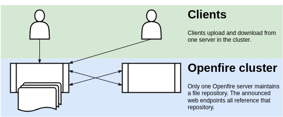
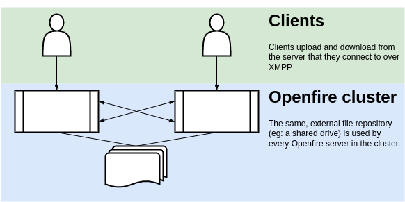

# Openfire HTTP File Upload Plugin

Adds [XEP-0363](https://xmpp.org/extensions/xep-0363.html) functionality to Openfire that allows compliant clients to exchange files.

## CI Build Status

## Reporting Issues

Issues may be reported to the [forums](https://discourse.igniterealtime.org) or via this repo's [Github Issues](https://github.com/igniterealtime/openfire-httpFileUpload-plugin).

## Overview

The HTTP File Upload plugin adds functionality to Openfire that allows compliant clients to exchange files. The protocol implemented by this plugin is defined in [XEP-0363: HTTP File Upload](https://xmpp.org/extensions/xep-0363.html).

**Note:** This plugin requires the HTTP bind option in Openfire to be enabled: `Server -> Server Settings -> HTTP Binding`

## Installation

Copy `httpfileupload.jar` into the plugins directory of your Openfire installation. The plugin will then be automatically
deployed. To upgrade to a new version, copy the new `httpfileupload.jar` file over the existing file.

## Using the Plugin

After installation, the functionality provided by the plugin is automatically available to clients. While exchanging
files, the plugin by default stores the files that are being transferred in a temporary directory that is removed when 
Openfire is shut down. The content of this directory is purged when its total size is larger than the remaining disc space.

## Configuration

Most configuration options can be controlled by two different properties. Apart from using regular Openfire properties,
controlled in the Openfire admin console, XML properties can be used. XML properties are properties stored in the
`openfire.xml` file.

Regular properties are stored in the database. This will ensure that a property value is equal on all servers in a
cluster of Openfire servers. When it is desirable to have a property values that are _different_ on each server, an
XML property can be used (as the content of the openfire.xml file can be different on each server).

When both a regular and an XML property is defined, then the XML property value will take precedence.

### Storage of data on filesystem

- XML property: `plugin.httpfileupload.serverspecific.fileRepo`
- System Property: `plugin.httpfileupload.fileRepo`

By default, the plugin will store all uploaded files in a temporary directory that is provided by the Operating System.
This directory is configured to be deleted, after Openfire quits. Some Operating Systems are known to periodically purge
these temporary directories, which is another potential source of data loss. This plugin can be configured to use any 
other directory for data storage, by providing the path for that directory in either property listed above. Note that 
the directory is expected to exist (this plugin will not attempt to create it if it is missing). Be sure that the 
process owner of the Openfire process has enough permissions to read and write in that directory.

### Maximum file size

- XML property: `plugin.httpfileupload.serverspecific.maxFileSize`
- System Property: `plugin.httpfileupload.maxFileSize`

To configure the maximum allowable file size to be uploaded by clients, the property defined above can be set to a value
in bytes. If not set, a default value is used. To disable the file size limitation, set a property to a value of `-1`.

### Announced web endpoint

The plugin will send URLs to the client that are to be used to upload or download data. To following properties can be
used to control the composition of the URLs that are generated.

To change the HTTP server protocol from the default value of "https" to "http" for example, use these properties:

- XML property: `plugin.httpfileupload.serverspecific.announcedWebProtocol`
- System Property: `plugin.httpfileupload.announcedWebProtocol`

To change the HTTP server hostname from the default value used by Openfire, use these properties:

- XML property: `plugin.httpfileupload.serverspecific.announcedWebHost`
- System Property: `plugin.httpfileupload.announcedWebHost`

To change the HTTP server port from the default value (7443) used by Openfire, use these properties

- XML property: `plugin.httpfileupload.serverspecific.announcedWebPort`
- System Property: `plugin.httpfileupload.announcedWebPort`

To change the web context root as announced to clients from the default value (`/httpfileupload`) used by use these
properties:

- XML property: `plugin.httpfileupload.serverspecific.announcedWebContextRoot`
- System Property: `plugin.httpfileupload.announcedWebContextRoot`

### ClamAV Malware Scanner Integration

The plugin can be integrated with an external malware scanner ([read more below](#malware-scanning)). These properties 
are used for that.

To enable or disable the integration, use this property. When the ClamAV daemon cannot be reached while the feature is
enabled, all file uploads will be rejected.

- System Property: `plugin.httpfileupload.clamavEnabled`

Controls the host that is used to integrate with an external (third-party) ClamAV malware scanner daemon.

- System Property: `plugin.httpfileupload.clamavHost`

Controls the port that is used to integrate with an external (third-party) ClamAV malware scanner daemon.

- System Property: `plugin.httpfileupload.clamavPort`

Defines the duration (in milliseconds) after which Openfire giving up trying to establish a TCP connection to the ClamAV
scanner daemon.

- System Property `plugin.httpfileupload.clamavConnectionTimeout`

## Scanning for Malware

To facilitate virus scanning, you can configure the application to use ClamAV. ClamAV is a third-party, open source
(GPLv2) anti-virus toolkit, available at [www.clamav.net](https://www.clamav.net/)

To configure this application to use ClamAV, install, configure and run clamav-daemon, the scanner daemon of ClamAV.
Configure the daemon in such a way that Openfire can access it via TCP.

Note: ClamAV is configured with a maximum file size. Ensure that this is at least as big as the `maxFileSize` that is
provided as an argument to the HTTP File Upload Plugin.

Then, configure the HTTP File Upload plugin the `clamavHost` and `clamavPort` arguments as described in the
[Configuration paragraph](#configuration). When these are provided, the application will supply each file that is being
uploaded to the ClamAV daemon for scanning. A file upload will fail when the ClamAV daemon could not be reached, or,
obviously, when it detects malware.

While malware scanning can offer some protection against distributing unwanted content, it has limitations. Particularly
when the uploaded data is encrypted, the scanner is unlikely able to detect any malware in it.

When using in an Openfire cluster
---------------------------------

Special consideration needs to be given to the deployment of this plugin in a cluster of Openfire instances. This
section outlines the main concerns.

### Background: how clients interact with the servers

Unlike most other XMPP-related functionality, this 'HTTP File Upload' functionality uses an additional data path: not
only is the XMPP connection itself used; HTTP requests are also made. The HTTP protocol is used to upload and download
data. The URLs for these interactions are sent over the XMPP data channel.

In a typical scenario, a client that wants to send a file requests an 'upload slot' through XMPP. When assigned a slot,
its URL (as well as other metadata) is returned to the client by the server. Using this information, the client will 
then upload the data using an HTTP PUT request. After the upload has succeeded, the client will send, over XMPP, send 
the URL to the intended recipients of the data. Their clients will receive that URL (over XMPP) and subsequently perform
an HTTP GET request to download the data from the web server.

### Configuration A: Using multiple service endpoint addresses

When each of the Openfire cluster node servers is connected directly to the internet, accessible to clients through 
their fully qualified domain name, then no configuration might be needed to make HTTP File Upload functionality
available on all cluster nodes, for all clients.

#### Option 1: Each Openfire manages a unique set of data

Diagram illustrating option 1: each Openfire uses its own data store.

_pros & cons:_ This solution requires no configuration, provides adequate scalability, but does not offer much data
redundancy or flexibility in network architecture.

Since version 1.2.0 of this plugin, the definition of a Slot is shared across all XMPP cluster nodes. This slot defines
the endpoint addresses to be used by the uploader, as well as the recipients of the data.

In the scenario described by this configuration option, each Openfire cluster node will issue slots that contain
endpoint URLs that are specific to the server that issued the slot. This means that the upload, as well as all
downloads, will be directed to URL on that same server.

### Configuration B: Using one service endpoint address

In certain environments it is undesirable or unpractical to expose more than one endpoint URL to chat clients. This is
frequently the case when the network architecture includes a load balancer. For this or other reasons, it might have 
been necessary to reconfigure the 'announced' endpoints (using the configuration options defined in the 
[Configuration paragraph](#configuration) of this document) to use the same endpoint address for all requests.

#### Option 2: Use only one server for file upload/download

Diagram illustrating option 2: One Openfire used for all file storage.

_pros & cons:_ This solution is typically easy to configure, but provides poor redundancy and scalability.

In this scenario, the singular endpoint address could be mapped to exactly one Openfire cluster node. This can be 
achieved by directly mapping the 'announced' endpoint details to the address of one of the Openfire nodes, (as described
in the [Configuration paragraph](#configuration) of this document) or by configuring the load balancer to 'balance' the
traffic to just one of the nodes.

#### Option 3: Use every cluster node for file upload/download

Diagram illustrating option 3: Cluster uses centralized file storage.

_pros & cons:_ More complex to configure, but provides better redundancy and scalability.

When a singular endpoint address is used, then this option typically involves a load balancer that distributes the HTTP
requests over all cluster nodes. This comes with some complexities:

* It is hard to ensure that the cluster node used by the XMPP connection of the client sharing/uploading the data is the 
  same cluster node used when performing the HTTP upload.
* It is often impossible to guaranteed that HTTP requests made by intended recipients of the uploaded data end up at the
  same cluster node as the one that was used to upload the data to.

When using this configuration option, it should be assured that every XMPP cluster node can fulfill HTTP upload and 
download requests for all slots.

Since version 1.2.0 of this plugin, the definition of a Slot is shared across all XMPP cluster nodes. To ensure that all
data is accessible, all cluster nodes should use the same shared network folder for file storage. This network folder
should be available on the filesystem of each of your Openfire servers, using the same path name. This plugin should be
configured to use this directory for data storage, by using the `plugin.httpfileupload.fileRepo` property, as described 
in the [Configuration paragraph](#configuration) of this document.

Realisation of a shared network folder is likely highly specific to the operating system used for your Openfire servers,
and is out of scope for this document.

## Attribution

Icons made by [Smashicons](https://www.flaticon.com/authors/smashicons "Smashicons") from [www.flaticon.com](https://www.flaticon.com/ "Flaticon") is licensed by [CC 3.0 BY](http://creativecommons.org/licenses/by/3.0/ "Creative Commons BY 3.0").  
Diagrams created on [diagrams.net/draw.io](https://diagrams.net "diagrams.net/draw.io").
